# Human vs. AI Text Classification
## A 6-Metric Linguistic Baseline

**Subject:** SC203 - Scientific Method
**Research Team:** Sahur
**Dataset:** Roy et al. (2025) Subset

---

# Agenda

1. **Motivation**: The "Arms Race" of Generative AI.
2. **The Dataset**: Roy et al. (2025) & Data Engineering.
3. **Pipeline Architecture**: From Ingestion to Parquet.
4. **The 6 Core Metrics**: Definitions & Calculation Logic.
5. **Lexical Analysis**: IRAL Log-Odds Ratio.
6. **Findings & Discussion**: Interpreting the "Human Fingerprint".

---

# The Problem: AI is "More Human than Human"

- **Context:** Large Language Models (LLMs) like GPT-4 and Mistral produce highly coherent text.
- **The Challenge:** Distinguishing AI text is critical for academic integrity and preventing misinformation.
- **Current State:** "Zero-shot" black-box detectors often fail on domain-specific text (*Wu et al., 2024*).

> "The need to discriminate human writing from AI is now both critical and urgent." — *Desaire et al. (2023)*

---

# Beyond Detection: A Paradigm Shift

**New Scientific Baseline:** *Zhu et al. (2025)* (Computer Assisted Language Learning).

- **The Insight:** AI corpora are not just "cheat tools" but essential instruments for scaffolding L2 writing.
- **Our Goal:** We do not aim to merely *differentiate*; we aim to **point out differences** to find the "best of both worlds."
- **Application:** Teaching students genre awareness and structural comprehension by visualizing the "fingerprints" of both Human and AI text.

> "AI-powered corpora are essential instruments for scaffolding L2 writing." — *Zhu et al. (2025)*

---

# Our Approach: Software-Level Linguistic Analysis Pipeline

We implement a full software pipeline (not just metric extraction) that is production-ready, modular, and reproducible. This is an engineering-first project combining NLP research and software best practices.

---
### Why a Software-Level Pipeline?
- **Engineering Focus:** Designed for long-term maintenance, extensibility, and integration into other systems (APIs, dashboards, CI).
- **Reproducibility:** Deterministic preprocessing, cached `spaCy` parses, and Parquet artifacts to enable bit-for-bit reproducible experiments.
- **Observability:** Built-in logging, error handling, and failure isolation so large batches don't fail silently.
- **Pluggable Metrics:** Each feature in `src/metrics_core.py` is stateless and testable, enabling safe replacements and experiments.
---
### What this enables
- Rapid A/B testing of metrics and model attributions.
- Automated report generation, visualizations, and deployable microservices.
- Clear boundaries between data, compute, and presentation layers for easier audits and education.

---

# The Dataset: Roy et al. (2025)

We utilize the **"Comprehensive Dataset for Human vs. AI Generated Text Detection"**.

- **Source Scale:** **58,000+** text samples (Full Dataset).
- **Our Focus:** **Training Split** (~7,300 rows) for deep linguistic analysis.
- **Human Baseline:** New York Times (NYT) articles (High-quality, edited journalism).
- **AI Contenders:** 6 Models generated from abstract prompts:
  - Gemma-2-9b, Mistral-7B, Qwen-2-72B
  - LLaMA-8B, Yi-Large, GPT-4o

---

# Dataset Context & Research Goals

**Source:** *Defactify 4: Multimodal Fact-Checking* (Co-located with AAAI 2025).

**Alignment with Research Objectives:**
We fulfill the dataset's call for **Feature Engineering**:
> "Investigate linguistic, stylistic, and semantic features that are indicative of AI generation... to capture nuanced patterns." — *Roy et al. (2025)*

**Project Trajectory:**
1.  **Current Phase (SC203):** Feature Engineering (The Explainable Pipeline).
2.  **Future Phase:** Developing Robust Classifiers (High-Ranked Research Goal).

---

# Data Cleaning & Pipeline

Based on our project architecture:

1.  **Ingestion:** Raw CSVs from Roy et al. loaded via `src.cli`.
2.  **Curation:** Shortlisted **25 high-quality rows** per topic (for Balanced Benchmarking).
    - *Reasoning:* Ensures fair comparison between large shards (Tech: 1,459) and small shards (Environment: 40).
    - *Selection:* Long paragraphs rich in sentence structure (Manual + AI assisted).
3.  **Sanitization:**
    - Removal of nulls and artifacts.
    - Alignment of `human_story` vs. `model_output` columns.
4.  **Processing:** Sharded processing with `spaCy` and `DuckDB` (Parquet output).

---

# Data Engineering: Topic Sharding

To ensure metrics hold true across diverse contexts, we implemented a rigorous **16-shard strategy**:

- **Major Shards (Raw):** Technology (1,459), Politics (1,187), Entertainment (806).
- **Niche Shards (Raw):** Environment (40), Travel (61), Science (88).

**Processing Statistics:**
| Stage | Count | Notes |
| :--- | :--- | :--- |
| **Input** | 7,321 | Raw rows (Training Set) |
| **Filtered** | 1,744 | Removed (Timeouts/Errors) |
| **Final** | **5,577** | High-fidelity rows |

---

# The 6 Core Metrics

We extract these features to capture the "fingerprint" of human writing:

1.  **MTLD** (Lexical Diversity)
2.  **Nominalization Density** (Academic formality)
3.  **Modal/Epistemic Rate** (Hedging/Equivocal language)
4.  **Clause Complexity** (Syntactic depth)
5.  **Passive Voice Ratio** (Stylistic preference)
6.  **S2S Cosine Similarity** (Semantic repetition)

---

# Metric 1: MTLD (Lexical Diversity)

**Definition:** *Measure of Textual Lexical Diversity*. It measures vocabulary richness by calculating the mean length of sequential word strings that maintain a Type-Token Ratio (TTR) above a threshold (0.72).

**Relevance:**
- Humans generally use more varied, context-rich vocabulary tied to personal experience (*Zhang & Crosthwaite, 2025*).
- AI tends to be "safe" and repetitive, leading to lower diversity scores in long texts.

---

# Metric 1: Calculation Logic

**Algorithm:**
1. Initialize `TTR = 1.0`, `count = 0`, `factors = 0`.
2. Iterate through tokens. Update TTR (Unique/Total).
3. If `TTR < 0.72`:
   - Increment `factors`.
   - Reset TTR.
4. Final Score: `Total Words / Factors`.

**Example:**
- **Human:** "The feline slept. The pet rested." (High MTLD $\rightarrow$ TTR stays high).
- **AI:** "The cat sat. The cat sat." (Low MTLD $\rightarrow$ TTR drops fast).

---

# Metric 2: Nominalization Density

**Definition:** The frequency of nouns derived from verbs or adjectives (e.g., *implement* $\rightarrow$ *implementation*).

**Relevance:**
- A marker of **formal, academic human writing** (*Zhang & Crosthwaite, 2025*).
- AI models often simplify phrasing for clarity, reducing nominalization density.

**Formula:**
$$D_{nom} = \frac{\text{Count}(\text{suffix} \in \{-\text{tion}, -\text{ment}, -\text{ness}, -\text{ity}\}) \times 1000}{\text{Total Words}}$$

---

# Metric 2: Calculation Example

**Compare:**

> **Human (High Density):** "The **implementation** of the **regulation** caused **frustration**."
> *3 nominalizations per 7 words.*

> **AI (Low Density):** "People were frustrated because they implemented the rule."
> *0 nominalizations.*

---

# Metric 3: Modal & Epistemic Rate

**Definition:** The frequency of "hedging" words (modals) and contrastive conjunctions.

**Relevance:**
- *Desaire et al. (2023)* found scientists have a penchant for **equivocal language** (*however, although*).
- AI tends to be declarative and confident.

**Target Tokens:**
`[might, may, could, perhaps, possible, unlikely, however, although, but]`

---

# Metric 3: Calculation Example

**Formula:**
$$R_{modal} = \frac{\text{Count}(\text{Target Tokens}) \times 100}{\text{Total Words}}$$

**Example:**
> **Human:** "These results **suggest** that it **may** be possible, **although** further study is needed."
> *High Epistemic Rate.*

> **AI:** "This proves that it is possible. Future studies are needed."
> *Low Epistemic Rate.*

---

# Metric 4: Clause Complexity

**Definition:** The average depth of the syntactic dependency tree.

**Relevance:**
- Humans exhibit "Burstiness": a mix of simple and deeply complex sentences.
- *Desaire et al. (2023)* noted that sentence length diversity is a key feature of human writing.

**Calculation:**
Using `spaCy` dependency parsing, we calculate the maximum depth from the `ROOT` verb to the furthest leaf node.

---

# Metric 4: Calculation Example

**Sentence:** *"The dog that chased the cat, which was fast, barked."*

**Tree:**
1. **barked** (ROOT, Depth 0)
2. $\rightarrow$ **dog** (nsubj, Depth 1)
3. $\rightarrow$ $\rightarrow$ **chased** (relcl, Depth 2)
4. $\rightarrow$ $\rightarrow$ $\rightarrow$ **cat** (dobj, Depth 3)
5. $\rightarrow$ $\rightarrow$ $\rightarrow$ $\rightarrow$ **was** (relcl, Depth 4)

**Human:** Mean Depth 4.5 | **AI:** Mean Depth 3.0 (Flatter trees).

---

# Metric 5: Passive Voice Ratio

**Definition:** The percentage of sentences utilizing passive voice construction.

**Relevance:**
- Stylistic fingerprint. Scientific humans prefer Passive; Journalism prefers Active (*Desaire et al., 2023*).
- AI generally defaults to Active voice unless prompted otherwise.

**Extraction Logic:**
Locate dependency tag `nsubjpass` (nominal subject passive) + `auxpass`.

---

# Metric 5: Calculation Example

**Check:**
$$\text{Ratio} = \frac{\text{Count}(\text{Passive Sentences})}{\text{Total Sentences}}$$

**Example:**
> 1. "The decision **was made** by the committee." ($\checkmark$ Passive)
> 2. "The committee made the decision." ($\times$ Active)

---

# Metric 6: S2S Cosine Similarity

**Definition:** *Sentence-to-Sentence Semantic Similarity*. Using Sentence-Transformers (Embeddings) to measure semantic overlap between adjacent sentences.

**Relevance:**
- AI optimizes for "coherence," leading to high similarity (repetitiveness).
- Humans make "semantic jumps" (introducing new ideas).
- *Technical Basis:* Efficient sentence embeddings via DCT (*Almarwani et al.*).

**Formula:**
$$S_{sim} = \cos(\vec{v}_n, \vec{v}_{n+1}) = \frac{\vec{v}_n \cdot \vec{v}_{n+1}}{\|\vec{v}_n\| \|\vec{v}_{n+1}\|}$$

---

# Metric 6: Calculation Example

**Model Used:** `all-MiniLM-L6-v2` (via `sentence-transformers`).

**Scenario 1: High Similarity (AI Tendency)**
> **S1:** "The algorithm optimizes for efficiency."
> **S2:** "The code runs faster to save time."
> **Score:** $\approx 0.82$ (High Semantic Overlap)

**Scenario 2: Low Similarity (Human Tendency)**
> **S1:** "The algorithm optimizes for efficiency."
> **S2:** "However, user privacy remains a concern."
> **Score:** $\approx 0.28$ (Semantic Jump)

---

# Evolution from Baseline (Herbold et al., 2023)

**Article:** *"A large-scale comparison of human-written versus ChatGPT-generated essays"*
**Authors:** Steffen Herbold et al.
**Source:** *Scientific Reports* (Nature Portfolio, Q1 | Impact Factor ~3.9).
**Strategy:** Moving from "Counting" to "Semantic" analysis.

| Feature | Herbold (Baseline) | Our Expansion |
| :--- | :--- | :--- |
| **Coherence** | Word Counts (e.g., "however") | **S2S Embeddings** (Semantic Flow) |
| **Style** | Not Measured | **Passive Voice** (Academic vs. AI) |
| **Complexity** | Tree Depth | **Clause Density** (Unified metric) |

> **Why?** We measure *meaning* and *structure*, not just surface-level keywords.

---

# Technical Deep Dive: Nominalization

**The Baseline Flaw (Herbold et al.):**
- Simple suffix counting (e.g., words ending in *-tion*).
- **Risk:** False positives like "Station" or "Lion".

**Our Improvement (Lemma Verification):**
- We check if the **Lemma** (root) differs from the **Surface Form**.

```python
# Logic in metrics_core.py
if lemma_lower != text_lower:
    return True # It's a derived noun (e.g., Create -> Creation)
```

---

# Reimplementation of the IRAL Research
Our project started off as a reimplementation of this article's  pipeline in Python

**Source:** *Zhang & Crosthwaite (2025)* - "More human than human?" (IRAL).

**Methodological Divergence:**

| Feature | Original Paper | Our Implementation (`iral_lexical.py`) |
| :--- | :--- | :--- |
| **Metric** | Z-score & Lambda | **PMI** (Pointwise Mutual Information) |
| **Goal** | Balance frequency & strength. | Measure predictive association. |
| **Bias** | Favors **High-Frequency** pairs. | Favors **Low-Frequency** pairs. |

> **Why?** PMI allows us to detect highly specific "hallucinations" or rare token bindings that act as strong model signatures, even if they appear infrequently.

---


# Methodology Upgrade: From R to Python

**The Original Baseline:**
- The IRAL paper relied on **R** (R Studio, `quanteda` package).
- **Limitation:** Often designed for smaller, static datasets; harder to integrate into real-time production pipelines.

**Our Contribution (SC203):**
- **Complete Reimplementation:** We ported the statistical logic to **Python**.
- **Tech Stack:**
  - **Logic:** `iral_lexical.py` for Log-Odds and collocation extraction.
  - **Orchestration:** `iral_orchestrator.py` for batch processing 58k samples.
  - **Visualization:** `iral_plots.py` for automated figure generation.

---

# IRAL Lexical Analysis (Log-Odds)

Inspired by *Zhang & Crosthwaite (2025)*, we identify "giveaway" words.

**Method (Log-Odds Ratio):**
$$\text{Log Odds} = \ln \left( \frac{\text{Freq}(W)_{\text{AI}} + 0.5}{\text{Freq}(W)_{\text{Human}} + 0.5} \right)$$

**Interpretation:**
- **Positive Score:** Strongly associated with AI.
- **Negative Score:** Strongly associated with Human.

---

# Inside `iral_lexical.py`: The Reimplementation of the Baseline

We implemented the **Log-Odds Ratio with Informative Dirichlet Prior** directly in Python.

**The Algorithm:**
1.  **Tokenization:** Clean tokens using the shared `spacy` pipeline.
2.  **Counting:** Efficient frequency counts for Human corpus ($y_{human}$) vs. AI corpus ($y_{ai}$).
3.  **Smoothing:** Apply statistical smoothing to handle zero-frequency words.
4.  **Z-Score Calculation:** Compute the z-score for each word to determine significance ($z > 1.96$).

> **Result:** A statistically robust list of "Giveaway Words" generated automatically for every model.

---

# Inside `iral_plots.py`: Automated Insights

Instead of manual plotting in R Studio, our pipeline automatically generates:

1.  **Log-Odds Charts:** Visualizing the "fight" between Human words (negative) and AI words (positive).
2.  **Collocation Clouds:** Extracting bigrams (e.g., "climate change", "vital role") that appear significantly more often in AI text.

**Outcome:**
We moved from "analyzing a CSV" to a **push-button explainability engine** that instantly visualizes the linguistic divergence of any new model we test.

---

# Wordcloud Visualization: Lexical Signatures

<table class="wordcloud">
  <tr>
    <td>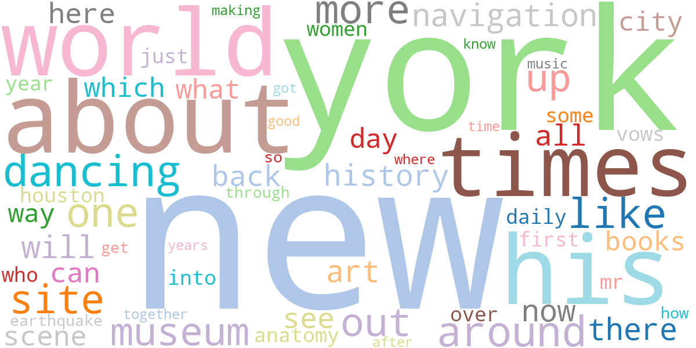<br><strong>Human (NYT)</strong></td>
    <td><br><strong>Gemma-2-9b</strong></td>
    <td><br><strong>GPT-4o</strong></td>
    <td>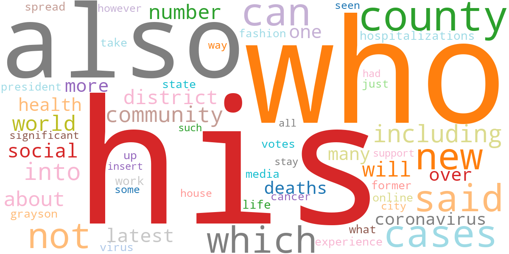<br><strong>LLaMA-8B</strong></td>
  </tr>
  <tr>
    <td>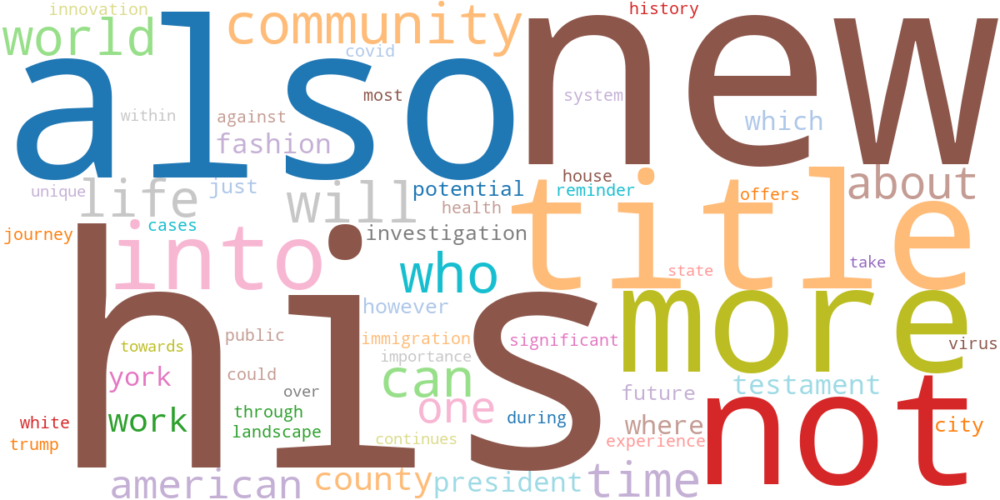<br><strong>Mistral-7B</strong></td>
    <td>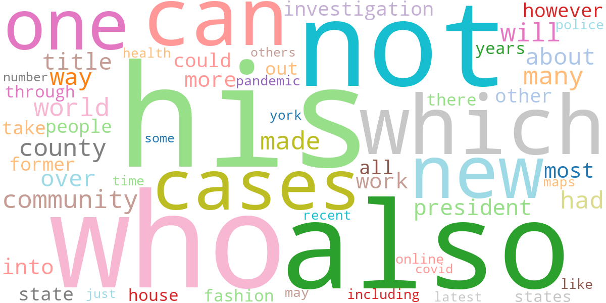<br><strong>Qwen-2-72B</strong></td>
    <td>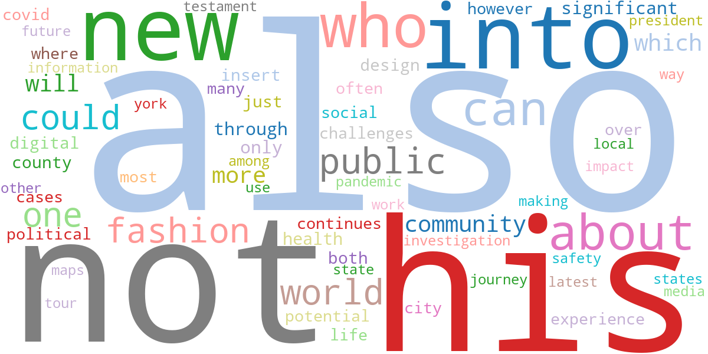<br><strong>Yi-Large</strong></td>
    <td></td>
  </tr>
</table>

---
# Heatmaps

<table class="heatmap">
  <tr>
    <td>
      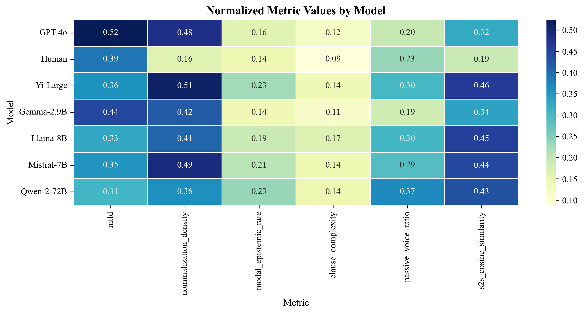
      <br><strong>Arts</strong>
    </td>
    <td>
      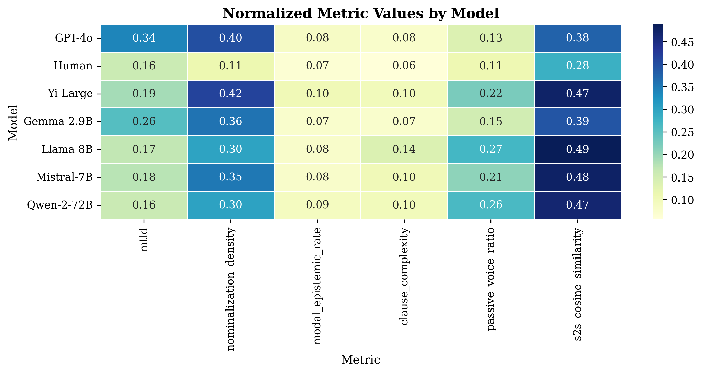
      <br><strong>Business</strong>
    </td>
    <td>
      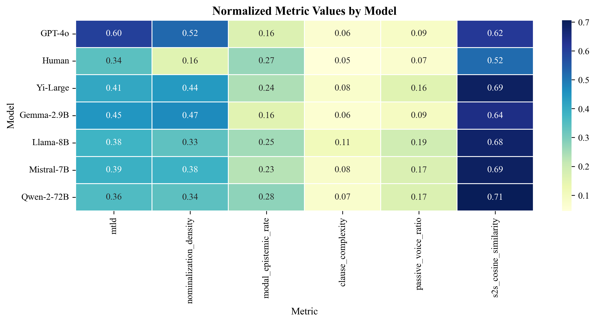
      <br><strong>Entertainment</strong>
    </td>
  </tr>
  <tr>
    <td>
      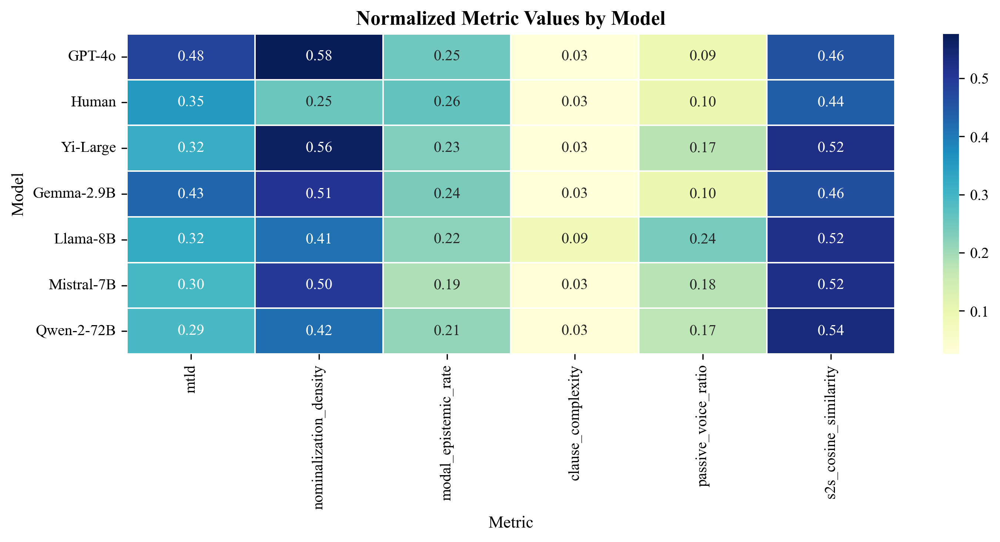
      <br><strong>Environment</strong>
    </td>
    <td>
      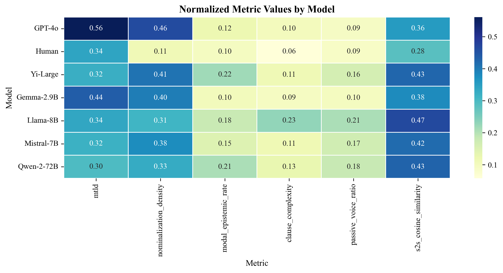
      <br><strong>Fashion</strong>
    </td>
    <td>
      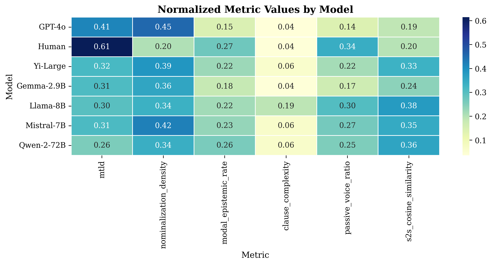
      <br><strong>Health</strong>
    </td>
  </tr>
</table>

---

# Heatmaps

<table class="heatmap">
  <tr>
    <td>
      
      <br><strong>LocalNews</strong>
    </td>
    <td>
      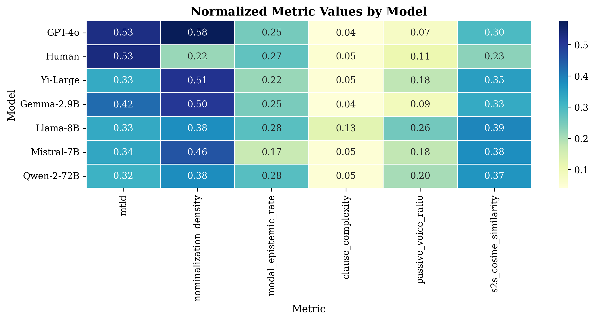
      <br><strong>Politics</strong>
    </td>
    <td>
      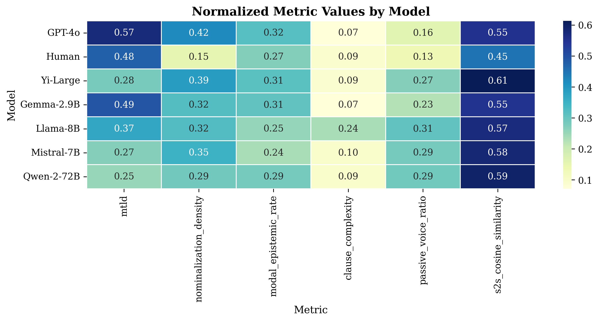
      <br><strong>Science</strong>
    </td>
  </tr>
  <tr>
    <td>
      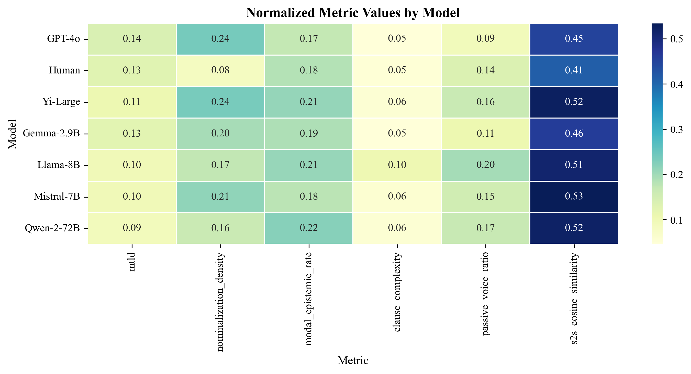
      <br><strong>Technology</strong>
    </td>
    <td>
      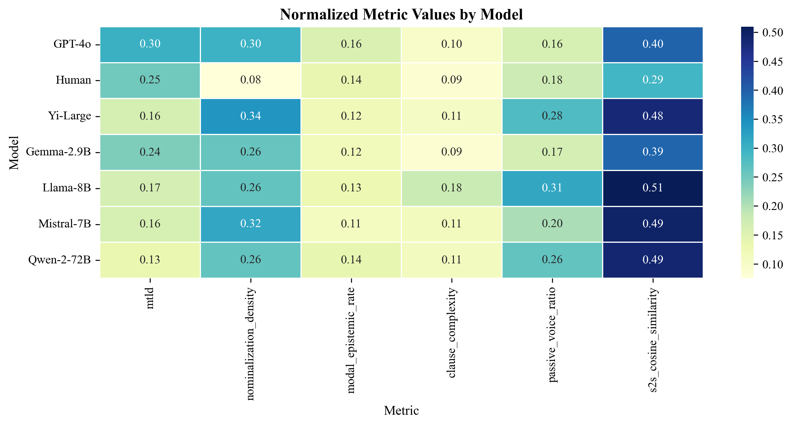
      <br><strong>Travel</strong>
    </td>
    <td>
      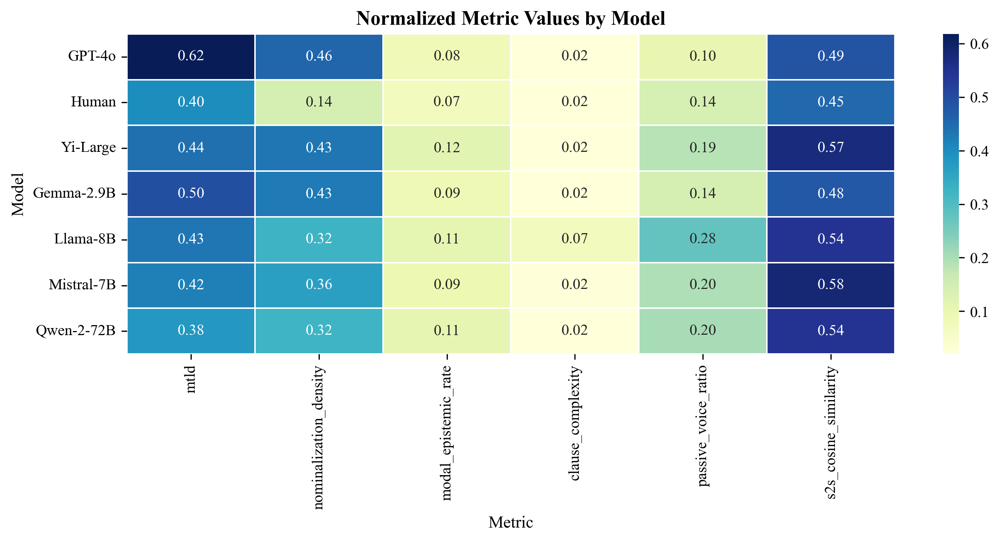
      <br><strong>Crime</strong>
    </td>
  </tr>
</table>


---
# Lexical Findings (Hypothesized)

Based on IRAL literature:

| Category | Human Words | AI Words |
| :--- | :--- | :--- |
| **Themes** | *Leaders, Food, Career, Youtube* | *Sustainable, Educational, Technical* |
| **Style** | *Said, Reported, Years* | *Delve, Landscape, Crucial, Pivotal* |
| **Type** | Concrete Entities | Abstract Concepts |

---

# Preliminary Findings: Complexity

**Hypothesis:**
Human text (NYT) will exhibit higher **Standard Deviation** in sentence length compared to AI.

**Evidence:**
- Desaire et al. found humans vary sentence length significantly more than AI.
- **Why?** AI generates tokens based on probability, favoring "average" sentence structures. Humans write for impact (Burstiness).

---

# Preliminary Findings: Hedging

**Hypothesis:**
Humans will have a higher **Modal/Epistemic Rate**.

**Evidence:**
- Humans use "maybe", "suggest", "however" to denote scientific or journalistic caution.
- AI outputs are often designed to be helpful and authoritative, reducing uncertainty markers.

---


# Cross-Topic Analysis & Synthesis
## Interpreting the Heatmaps

* **Variance Analysis:**
    * *Question:* Do we observe clearer differentiation in **Specialized Sectors** (Tech/Health) compared to **Lifestyle** topics?
    * *Hypothesis:* Technical vocabulary may limit the "creativity" of LLMs, making them easier to differentiate or attribute.
* **Model-Specific Patterns:**
    * *Observation:* Which model (Gemma, Mistral, Qwen, etc.) shows the most consistent heatmap signature across all 3 clusters?
* **Outliers:**
    * *Note:* Identify any topic (e.g., **Fashion**) where the heatmap significantly deviates from the average baseline accuracy.


# Interpretation of the Numbers

| GPT-4o | Human Writing | Llama-8B |
| :--- | :--- | :--- |
| **The "Sophisticated" Mimic** | **The Baseline** | **The Outlier** |
| Max **vocabulary diversity** & **nominalization**. | Distinct for **low nominalizations**. | Uses more **passive voice**. |
| Mimics human **active voice**. | **Lower similarity** (High uniqueness). | Slightly more **complex clauses**. |

---

# Discussion: The "Human Fingerprint"

What makes text "Human"?

1.  **Inconsistency:** We are "messy." We mix 5-word sentences with 50-word sentences.
2.  **Uncertainty:** We use hedging to show nuance.
3.  **Specificity:** We reference real-world entities (*Japan, YouTube*) more than abstract categories (*"Social Media"*).

---

# The "Hidden" Challenge: Data Hygiene

**Reality:** The raw dataset was not analysis-ready.
- **Source:** Scraped web data (PDF-to-Text artifacts).
- **Noise:**
  - "Page X" headers and footers breaking sentence flow.
  - Markdown symbols (`#`, `*`) and "source: [x]" citations embedded in text.
  - Non-narrative paragraphs (e.g., copyright notices).

> **Impact:** Raw noise artificially inflates "complexity" metrics, distorting the baseline for Human vs. AI comparison.

---

# Engineering Solution: Robust Ingestion

We implemented a custom sanitization module (`src.ingest`) to recover pure text.

**Key Cleaning Steps:**
1.  **Regex Filtration:** Removing PDF artifacts (e.g., `^source: \d+`, `--- PAGE \d+ ---`).
2.  **Structural Cleaning:** Stripping Markdown formatting to isolate pure prose.
3.  **Noise Rejection:** Discarding rows where text is too short or clearly navigational.
4.  **Column Alignment:** Ensuring `human_story` and `model_output` align perfectly for paired T-tests.

---

# Pipeline Architecture (Modular Design)

Our `src` codebase is built for reproducibility and scalability:

- **`ingest.py`**:  Sanitizes raw CSVs and aligns columns.
- **`parse_and_cache.py`**:  Runs `spaCy` NLP processing once and caches to disk (Parquet).
- **`metrics_core.py`**:  Stateless functions to calculate the 6 linguistic features.
- **`stats_analysis.py`**:  Automated Welch’s t-tests and Cohen’s d calculation.

> **Why this matters:** Modular design allowed us to rapidly swap out metrics and upgrade the IRAL component without breaking the ingestion logic.

---

# Engineering Highlights

- **Deterministic preprocessing:** deterministic tokenization, seedable sharding, and cached parse outputs to avoid nondeterminism between runs.
- **Failure isolation:** per-shard retries, timeouts, and DuckDB-based recovery for partial failures.
- **Data contracts:** YAML-driven `metrics_config.yaml` enforces expected schema and sampling rules, enabling safe upgrades.
- **Performance:** batch-parsing with `spaCy` and vectorized operations in `pandas`/`pyarrow` to process tens of thousands of documents efficiently.

---

# Reproducibility & Packaging

- **Environment:** `requirements.txt` + `setup_environment.py` to pin versions and bootstrap the environment.
- **Caching:** Parquet caches produced by `parse_and_cache.py` are canonical experiment inputs for metrics and plots.
- **Artifacts:** All experiments export deterministic Parquet + PNG/SVG results that can be reproduced from the same inputs.

---

# Testing, CI & Quality Gates

- **Unit tests:** `tests/` cover `metrics_core.py`, `ingest.py`, and `parse_and_cache.py` (run with `pytest`).
- **Integration tests:** end-to-end pipeline run on small sample shards via `tests/test_pipeline_endtoend.py`.
- **CI recommendations:** run `pytest`, linting, and a sample `parse_and_cache` job in CI to catch regressions early.

---

# APIs & Integration

- Expose metrics as a lightweight API or microservice for downstream dashboards.
- Provide a CLI in `src/cli.py` for reproducible experiment runs and targeted re-processing.
- Bundle models/embeddings downloads (e.g., sentence-transformers) into the setup flow to reduce first-run friction.

---

# Performance & Scaling Notes

- Horizontal scaling via topic-level sharding: each shard is an independent unit of work.
- Use `multiprocessing` or Kubernetes jobs to parallelize `parse_and_cache.py` across cores/nodes.
- Monitor memory for embedding steps (`sentence-transformers`) and prefer streaming/mini-batching.

---

# Roadmap & Next Steps (Engineering)

1.  Add a small HTTP server to expose metrics and visualizations for manual review.
2.  Add a reproducible Docker image and a minimal Helm chart for deployment to cluster.
3.  Add CI job to run a nightly sanity pipeline on a small representative sample.
4.  Expand unit tests for edge-case cleaning and nominalization lemma checks.


---

# Tools & Technologies

We leveraged a modern Python ecosystem to build a scalable, reproducible pipeline.

**Core Libraries:**
- **NLP & Parsing:** `spaCy` (Dependency Trees), `lexicalrichness` (MTLD).
- **S2S Extraction:** `sentence-transformers` (Model: `all-MiniLM-L6-v2`).
  - *Why?* High speed/accuracy balance for semantic similarity.
- **Data & Stats:** `pandas`, `scipy`, `statsmodels` (Welch's T-test).
- **Visualization:** `seaborn`, `matplotlib`.

> **Infrastructure:** The pipeline processes the dataset locally using efficient Parquet storage (`pyarrow`).

---

# Limitations & Challenges

1.  **Preprocessing Complexity:** NLP sanitization was extremely difficult. We relied on AI assistance to navigate the noise in raw web-scraped text.
2.  **Tooling Constraints:** While `spaCy` is powerful, achieving full control over the dataset's linguistic nuances requires more time than available.
3.  **Dataset Selection:** We discarded two cleaner datasets because they used older AI models. We chose *Roy et al. (2025)* to benchmark against modern LLMs (GPT-4o), accepting the trade-off of "noisier" data.
4.  **Genre Bias:** Our baseline is Journalism (NYT). Scientific papers might differ (e.g., higher passive voice).
5.  **Modeling Scope:** Our current focus is **Feature Engineering**. Expanding to production-grade ML classifiers requires further expertise.

---

# Conclusion & Next Steps

1.  **Conclusion:** An explainable pipeline offers a transparent baseline, not just for differentiation, but for **education**.
2.  **Future Application:** Developing a **Hybrid Writing Tool** for Educational Technology.
    - *Goal:* Retain the writer's original **effort, style, and tone**.
    - *Benefit:* Help L2 writers reduce errors and sound more academic without losing their voice.
3.  **The Vision:** Bridging the gap between **AI efficiency** and **Human creativity**.

---

# References

1.  **Roy et al. (2025).** *A Comprehensive Dataset for Human vs. AI Generated Text Detection.*
2.  **Wu et al. (2024).** *Who Wrote This? The Key to Zero-Shot LLM-Generated Text Detection Is GECSCORE.* COLING.
3.  **Zhang & Crosthwaite (2025).** *More human than human? Differences in lexis...* IRAL.
4.  **Desaire et al. (2023).** *Distinguishing academic science writing from humans or ChatGPT...* Cell Reports Physical Science.
5.  **Herbold et al. (2023).** *A large-scale comparison of human-written versus ChatGPT-generated essays.* Scientific Reports.
6.  **Almarwani et al.** *Efficient Sentence Embedding using Discrete Cosine Transform.*
7.  **Zhu et al. (2025).** *Enhancing EFL argumentative writing through an AI-powered corpus.* CALL.
8.  **Durak et al. (2025).** *A Comparison of Human-Written Versus AI-Generated Text...* European Journal of Education.
9.  **Al Bataineh et al. (2025).** *AI-Generated vs. Human Text: Introducing a New Dataset...* IEEE Transactions on AI.


---

# Thank You
## Questions?

**SC203 Research Team**